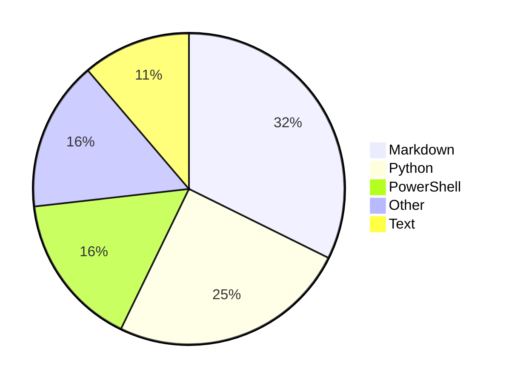

## Hi there 👋

<!--
**Alicia111/alicia111** is a ✨ _special_ ✨ repository because its `README.md` (this file) appears on your GitHub profile.

Here are some ideas to get you started:

- 🔭 I’m currently working on ...
- 🌱 I’m currently learning ...
- 👯 I’m looking to collaborate on ...
- 🤔 I’m looking for help with ...
- 💬 Ask me about ...
- 📫 How to reach me: ...
- 😄 Pronouns: ...
- ⚡ Fun fact: ...
-->

<picture>
  <!-- 當系統處於深色模式時顯示這張 -->
  <source media="(prefers-color-scheme: dark)" srcset="https://raw.githubusercontent.com/alicia111/alicia111/output/github-contribution-grid-snake-dark.svg">
  <!-- 當系統處於淺色模式或不支援時顯示這張 -->
  <source media="(prefers-color-scheme: light)" srcset="https://raw.githubusercontent.com/alicia111/alicia111/output/github-contribution-grid-snake.svg">
  <!-- 預設顯示 -->
  
</picture>

<!-- WAKATIME_START -->
#### 📊 過去一週的開發數據

<!-- WAKATIME_END -->
